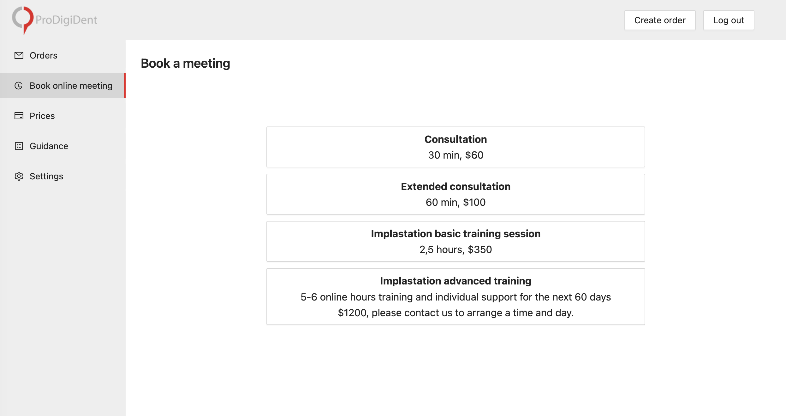
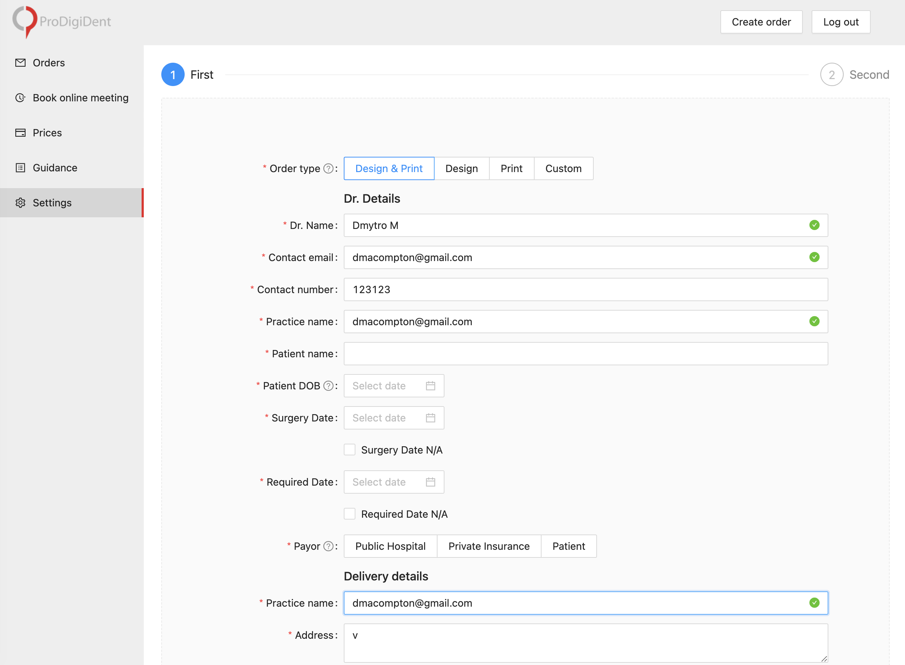
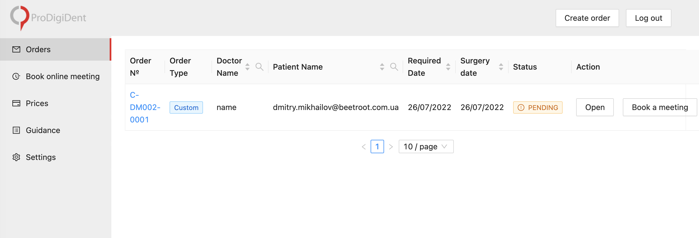
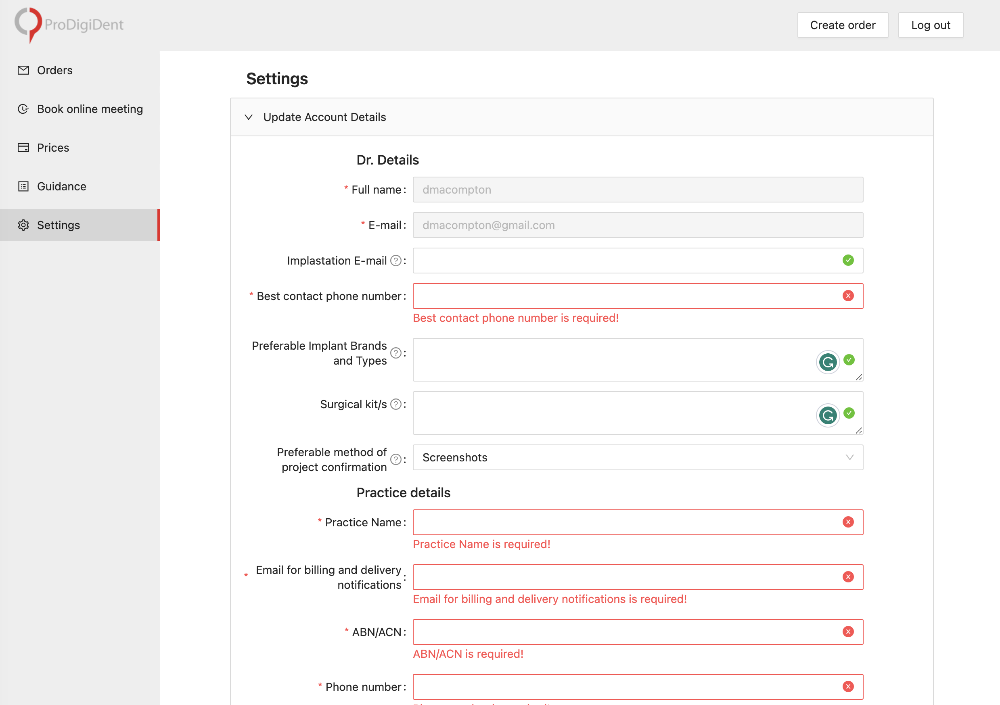
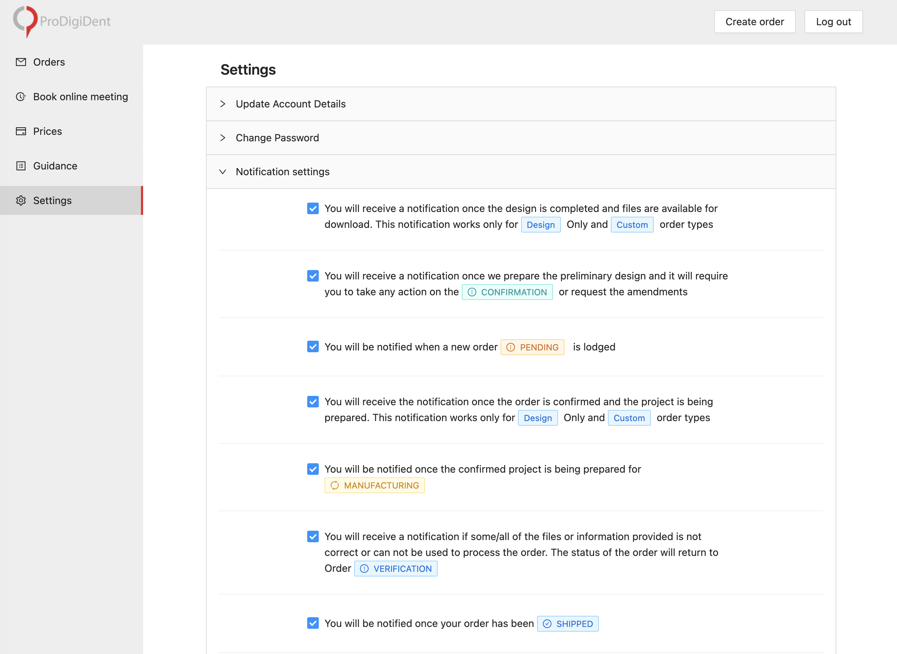
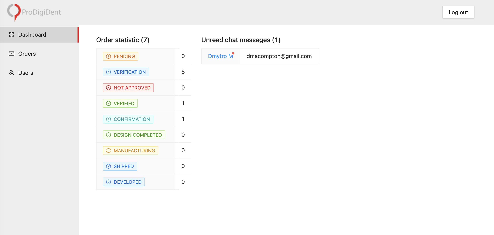
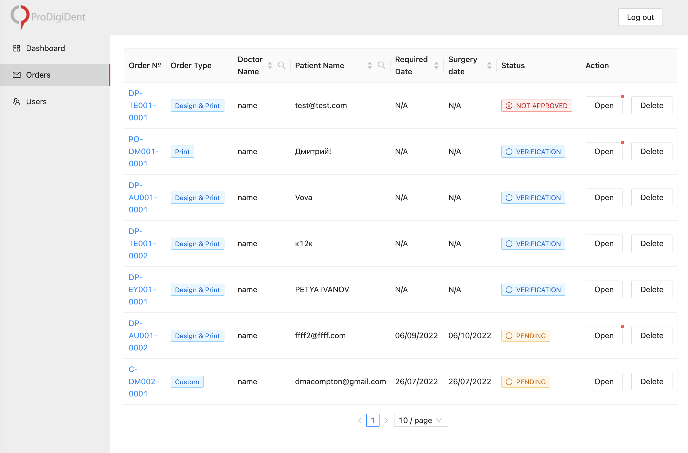
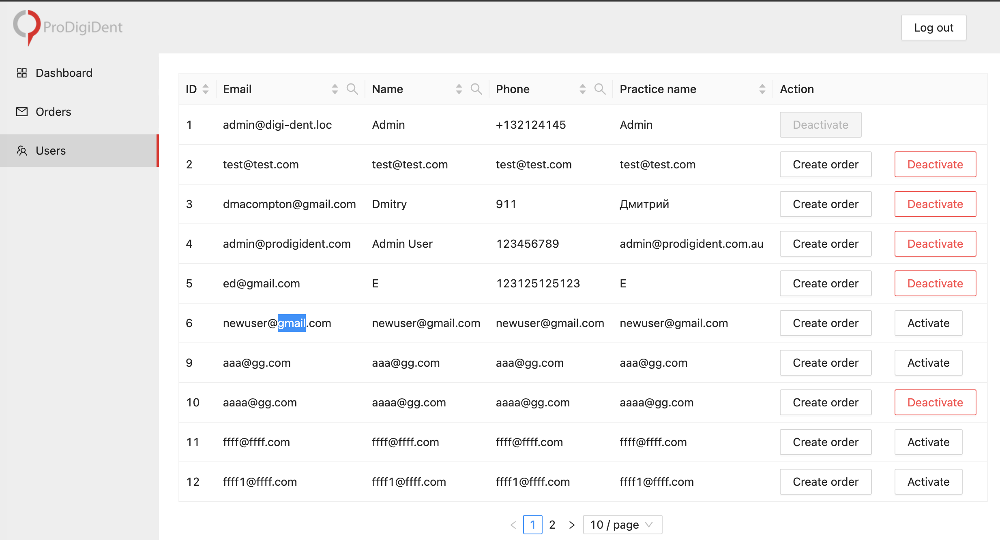

Pro Digi Dent is a CRM system that helps dental professionals manage their customer relationships and provide high-quality services. With Pro Digi Dent, customers can register (with an approval of admin), create an order with four types of order and more than 40 dynamic fields, upload files up to 4 GB with resume upload, chat related to each order, book online meetings or masterclasses via Calendly, and customize their settings.

`User - Book a meeting`

`User - Create Order`

`User - All Orders`

`User Settings - Details`

`User Settings - Notification`

Pro Digi Dent also has an admin panel, where admins can monitor and manage all the orders and users. The dashboard shows all types of orders sorted by status and unread chat messages. The all orders page displays all the orders in a table with pagination. The all users page allows admins to activate/deactivate users or create orders for them (in case the order is made by phone).

`Admin Dashboard`

`Admin All Orders`

`Admin All Users`

Pro Digi Dent is a CRM system that simplifies and enhances the workflow of dental professionals and their customers. It is designed to meet the specific needs and preferences of the dental industry. Pro Digi Dent is the ultimate solution for digital dentistry.

This project was bootstrapped with [Create React App](https://github.com/facebook/create-react-app), using the [Redux](https://redux.js.org/) and [Redux Toolkit](https://redux-toolkit.js.org/) template.

## Available Scripts

In the project directory, you can run:

### `yarn start`

Runs the app in the development mode. 
Open [http://localhost:3000](http://localhost:3000) to view it in the browser.

The page will reload if you make edits. 
You will also see any lint errors in the console.

### `yarn test`

Launches the test runner in the interactive watch mode. 
See the section about [running tests](https://facebook.github.io/create-react-app/docs/running-tests) for more information.

### `yarn build`

Builds the app for production to the `build` folder. 
It correctly bundles React in production mode and optimizes the build for the best performance.

The build is minified and the filenames include the hashes. 
Your app is ready to be deployed!

See the section about [deployment](https://facebook.github.io/create-react-app/docs/deployment) for more information.

### `yarn eject`

**Note: this is a one-way operation. Once you `eject`, you can’t go back!**

If you aren’t satisfied with the build tool and configuration choices, you can `eject` at any time. This command will remove the single build dependency from your project.

Instead, it will copy all the configuration files and the transitive dependencies (webpack, Babel, ESLint, etc) right into your project so you have full control over them. All of the commands except `eject` will still work, but they will point to the copied scripts so you can tweak them. At this point you’re on your own.

You don’t have to ever use `eject`. The curated feature set is suitable for small and middle deployments, and you shouldn’t feel obligated to use this feature. However we understand that this tool wouldn’t be useful if you couldn’t customize it when you are ready for it.

## Learn More

You can learn more in the [Create React App documentation](https://facebook.github.io/create-react-app/docs/getting-started).

To learn React, check out the [React documentation](https://reactjs.org/).
